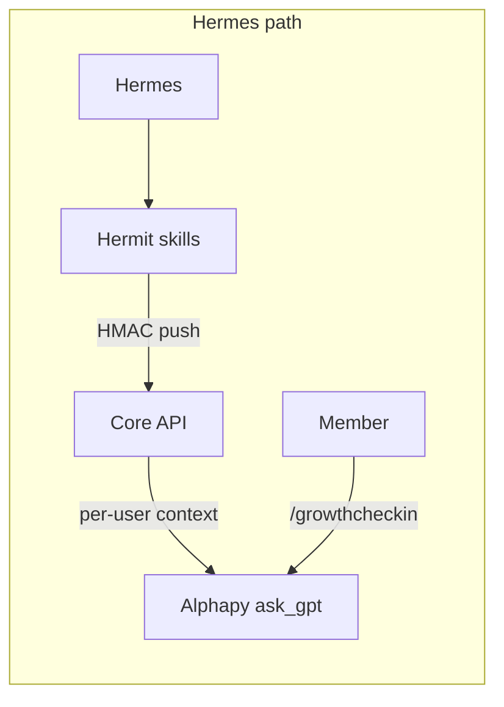

# Alphapy Agents — Architecture

Alphapy Agents are multi-user growth and reflection assistants inside the Discord bot. Linked members run short sessions via `/agent`, with multi-turn memory, skill-driven context, and strict privacy boundaries.

**Hermes** is the personal strategic agent (Nous Research, VPS). **Hermit** publishes strategic context to Core. **Alphapy Agents** serve all linked community members through a lightweight runtime in the bot process.

> **Naming:** Hermes is the Nous Research personal agent. Hermit is the Innersync Python skill host that publishes to Core. Hermes is not OpenClaw — unrelated projects.

---

## Platform stack

| Layer | Component | Role |
|-------|-----------|------|
| Personal agent | **Hermes** (Nous Research, VPS) | Long-horizon strategy, Discord DMs, owner-focused |
| Publisher | **Hermit** | Skill host → pushes strategic context to Core |
| Broker | **Core API** | Per-user `hermit_strategic_context`, `hermit_events` |
| Executor | **Alphapy** (`gpt/helpers.py`) | Grok calls; injects Hermit context and opt-in reflections |
| Identity | `alphapy_discord_links` + `/link` | Discord snowflake ↔ Innersync `sub` |
| Encrypted data | App (`EncryptionProvider`) | Zero-knowledge journals; plaintext only after opt-in share |



**Shared infrastructure:** Hermit skill protocol, Core event bus, `ask_gpt`, `load_user_reflections`, `get_innersync_id_for_discord`, webhook HMAC, premium GPT quota, `emit_hermit_event`.

---

## Runtime

A thin agent runtime inside Alphapy mirrors Hermit's skill registry pattern. Hermes remains the strategic layer for founders and power users; Alphapy Agents are the multi-tenant product loop for linked members.

```
Discord /agent start reflection
        │
        ▼
agents/runtime.py  ──► resolve agent + skills
        │                  │
        │                  └── journal_sync (reflections, streaks)
        ▼
agents/memory.py   ──► load/patch per-user memory (Supabase)
        ▼
ask_gpt()          ──► synthesize response (quota + Grok)
        ▼
complete_session + emit_hermit_event("gpt_command")
        │
        ▼
Hermit daily job (optional) reads events → strategic context refresh
```

Future API path (same runtime):

```
POST /api/agents/{agent}/run  (API key + user JWT via Core)
        └── run_agent_session(...)  # shared with Discord cog
```

### Module layout

```
alphapy/agents/
  base.py          AgentContext, AgentSkill protocol
  registry.py      Agent definitions + skill wiring
  memory.py        Supabase sessions + memory (in-memory fallback)
  runtime.py       Closed-loop orchestration
  skills/
    journal_sync.py
    trade_insight.py   # dormant — not registered until product decision
cogs/agents.py     /agent list|start|continue|end|status
```

---

## Commands

| Command | Behaviour |
|---------|----------|
| `/agent list` | Lists registered agents (`reflection`) |
| `/agent start [message]` | First turn; session stays `active` |
| `/agent continue <message>` | Append a turn using session message history |
| `/agent end` | Distil Tier 2, patch Tier 3, complete session, delete ephemeral messages |
| `/agent status` | Active session start time and turn count |

**Requirements:**

- Global: `ALPHAPY_AGENTS_ENABLED=true`
- Per guild: `/config agents toggle true` (SettingsService, default `false`)
- User: `/link` required (`get_innersync_id_for_discord`)
- Quota: `ask_gpt` daily limit and agent session caps (see [Security](../security/))

**Adding an agent:** implement skill(s) under `agents/skills/`, register in `agents/registry.py`, add `app_commands.Choice` in `cogs/agents.py` if exposed in slash UI.

**Adding a skill:** update the `skills` tuple in `_AGENT_DEFINITIONS`.

---

## Memory model

Sessions and durable memory live in Supabase (Core migrations `0020`, `0023`).

### Session lifecycle

1. `/agent start` → `create_session` (status `active`) → first LLM turn → rows in `agent_session_messages`
2. `/agent continue` → load message history → LLM → append turn
3. `/agent end` → Tier 2 distill (if consented) → `patch_user_memory` (Tier 3) → `complete_session` → delete `agent_session_messages`
4. `emit_hermit_event(gpt_command)` fires on **end**, not on start

`run_agent_session(finalize=True)` remains for tests — start and end in one call.

### Tables

**`agent_sessions`**

| Column | Type | Notes |
|--------|------|-------|
| `id` | uuid PK | Session id |
| `innersync_user_id` | uuid | Canonical user key |
| `discord_user_id` | text | Snowflake for ops/debug |
| `guild_id` | text nullable | Multi-guild scope |
| `agent_name` | text | e.g. `reflection` |
| `status` | text | `active`, `completed`, `failed` |
| `summary` | text nullable | Tier-2 distilled labels only (not raw LLM text) |
| `memory_patch` | jsonb | Delta applied this session |
| `metadata` | jsonb | Source, skill flags |
| `started_at` / `completed_at` / `updated_at` | timestamptz | Audit |

**`agent_memory`**

| Column | Type | Notes |
|--------|------|-------|
| `innersync_user_id` + `agent_name` | unique | One blob per user per agent |
| `memory` | jsonb | Tier 1 prefs (via App), Tier 2 `derived_profile`, Tier 3 operational metadata |
| `updated_at` | timestamptz | |

**`agent_session_messages`** (ephemeral multi-turn working memory; cascade-deletes on session end)

| Column | Type | Notes |
|--------|------|-------|
| `session_id` | uuid FK | References `agent_sessions.id` |
| `turn_index` | int | 0-based turn number |
| `role` | text | `user` or `assistant` |
| `content` | text | Prompt/response for that turn |
| `created_at` | timestamptz | |

**RLS:** Service role only (same pattern as `agent_sessions`).

---

## Skills

| Skill | Purpose |
|-------|---------|
| `journal_sync` | Opt-in reflections and engagement streak |
| `inner_voice` | Tier 1 `inner_voice` preference from App agent settings |
| `fatigue_check` | Energy self-report in App + Discord quick check on `/agent start` |
| `trade_insight` | Dormant — not exposed in `/agent` |

Enable locally:

```bash
ALPHAPY_AGENTS_ENABLED=true
ALPHAPY_AGENTS_MEMORY_BACKEND=memory   # no Supabase migration needed
# Per guild: /config agents toggle true
```

---

## Security & rate limits

| Concern | Mitigation |
|---------|------------|
| Identity | Require `/link`; key all rows by `innersync_user_id` |
| Encrypted journals | Only `load_user_reflections` / opt-in plaintext paths — never decrypt in bot |
| Prompt injection | `safe_prompt` on skill blocks; external context marked untrusted |
| GPT abuse | `check_and_increment_gpt_quota` inside `ask_gpt` |
| Agent session abuse | `check_and_increment_agent_session_quota` on `/agent start` (free: 10/day, monthly: 25/day) |
| Guild blast radius | `agents.enabled` off by default per guild |
| API (planned) | `verify_api_key` + Core JWT user resolution; per-user rate limit table |
| Premium | Higher GPT limits via existing tiers; optional `agents.premium_only` setting later |
| PII retention | Session `summary` capped at 4k chars; GDPR purge via `purge_agent_user_data()` |
| Transport | HTTPS + service role; no client-side Supabase keys in bot |

Agent session caps use the `agent_session_usage` table (Railway migration 024): free 10 starts/user/day, monthly 25, yearly/lifetime unlimited.

See [Safety guidelines](../agents-safety-guidelines/) for the jailbreak matrix and policy enforcement.

---

## Hermes vs Alphapy Agents

| | Hermes | Alphapy Agents |
|---|--------|----------------|
| Users | Owner / strategic | All linked members |
| Host | VPS (Nous Research) | Alphapy Railway |
| Memory | Core strategic context | `agent_memory` + sessions |
| Skills | Platform telemetry | User growth + trading |
| Trigger | Conversation / cron | `/agent`, API, cron |

`emit_hermit_event` keeps the Hermit closed loop informed without coupling runtimes.

---

## Planned work

- `POST /api/agents/run` on `api.py` (Mind/App trigger)
- Hermit job: batch context refresh for users with recent `gpt_command` events
- Agent session metrics in telemetry ingest

**Out of scope:** per-user Hermes deployment; decryption of App ciphertext; guild-admin visibility into agent outputs (ephemeral by default).

---

## Related docs

- [Safety guidelines](../agents-safety-guidelines/)
- [Configuration](../configuration/) — agent env vars
- [Commands](../commands/) — `/agent` reference
